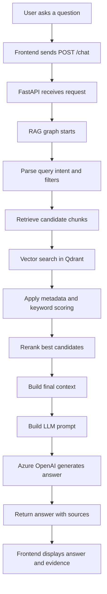

# Retrieval Workflow

This document gives a manager-friendly view of how the application answers a user question using Retrieval Augmented Generation.

## Executive Summary

When a user asks a question, the system does not send the question directly to the LLM. It first searches the indexed company documents, finds the most relevant text or visual chunks, reranks them, builds a controlled prompt, and then asks Azure OpenAI to answer only from that retrieved context.

## High-Level Workflow



## Workflow Stages

| Step | Stage | Purpose | Main Code |
| --- | --- | --- | --- |
| 1 | User question | User types a question in the chat UI. | `frontend/src/components/chat/ChatInput.tsx` |
| 2 | API request | Frontend sends the question to the backend. | `frontend/src/api/chatApi.ts` |
| 3 | Chat endpoint | Backend receives `POST /chat`. | `app/api/routes.py` |
| 4 | RAG orchestration | Coordinates the full retrieval and answer flow. | `app/rag/graph.py` |
| 5 | Query parsing | Detects year, quarter, file name, page, figure, chart, diagram, and visual intent. | `app/rag/query_parser.py` |
| 6 | Retrieval | Finds possible matching chunks from the vector store. | `app/rag/retriever.py` |
| 7 | Vector search | Converts the question into an embedding and searches Qdrant. | `app/vectorstores/qdrant_store.py` |
| 8 | Scoring | Combines vector similarity, keyword matches, and metadata matches. | `app/rag/retriever.py` |
| 9 | Reranking | Reorders candidates using a CrossEncoder reranker when available. | `app/rag/reranker.py` |
| 10 | Context preparation | Selects the final chunks that will be sent to answer generation. | `app/rag/graph.py` |
| 11 | Prompt creation | Formats instructions, retrieved context, source metadata, and the user question. | `app/rag/prompts.py` |
| 12 | Answer generation | Calls Azure OpenAI, or uses an extractive fallback if Azure is unavailable. | `app/rag/answer_generator.py` |
| 13 | Source display | Returns file names, pages, scores, matched text, and visual evidence URLs. | `app/rag/answer_generator.py` |

## Conceptual Reading Order

For learning the retrieval workflow, read these files in this order:

```text
app/main.py
  -> app/api/routes.py
  -> app/api/schemas.py
  -> app/rag/graph.py
  -> app/rag/query_parser.py
  -> app/rag/retriever.py
  -> app/vectorstores/qdrant_store.py
  -> app/rag/reranker.py
  -> app/rag/prompts.py
  -> app/rag/answer_generator.py
  -> app/core/config.py
```

## Key Design Points

- The LLM receives only retrieved document context, not the entire document set.
- Qdrant performs the first search using embeddings.
- Metadata filters help avoid mixing incorrect years, files, pages, or figures.
- Keyword and metadata scoring improve retrieval when vector similarity alone is not enough.
- Reranking improves the final ordering before answer generation.
- Prompt construction is separated from answer generation so the LLM instructions are easy to inspect.
- Every answer returns source information so the user can verify where the answer came from.

## Example Query Flow

Question:

```text
What was the revenue in Q4 2024?
```

Expected internal behavior:

```text
Detect metric: revenue
Detect quarter: Q4
Detect year: 2024
Search Qdrant for relevant chunks
Boost chunks with matching year and revenue metadata
Rerank the best chunks
Build prompt using only selected context
Generate answer from Azure OpenAI
Return answer with source file and page
```

## One-Line Version

The retrieval pipeline turns a user question into a filtered vector search, reranks the best document chunks, builds a grounded prompt, and returns an Azure OpenAI answer with traceable sources.
